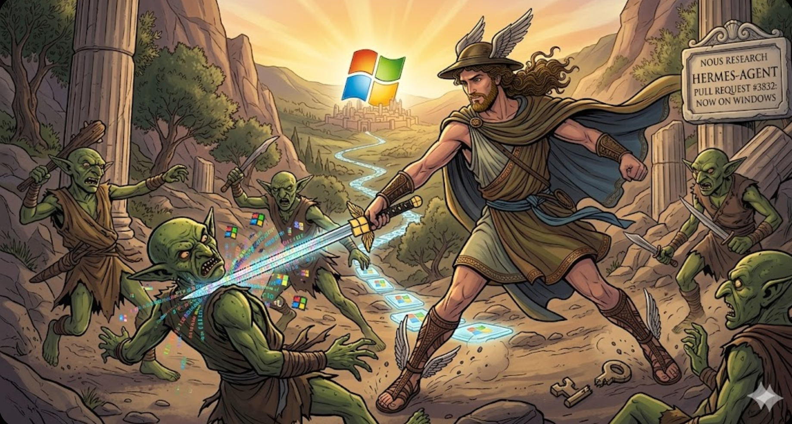

# Hermes Windows Installer



One-command Windows installer for [Hermes Agent](https://github.com/NousResearch/hermes-agent).

## Quick Install

Open PowerShell and paste one of these:

### Option A: Standard install (uses your existing Python)

```powershell
irm https://raw.githubusercontent.com/claudlos/hermes-windows-installer/main/scripts/install-windows.ps1 | iex
```

### Option B: Full AF_UNIX bootstrap (builds custom Python + installs Hermes)

```powershell
irm https://raw.githubusercontent.com/claudlos/hermes-windows-installer/main/scripts/bootstrap-windows-afunix-hermes.ps1 | iex
```

This downloads CPython 3.13.12, patches it for AF_UNIX socket support, compiles
it, and installs Hermes with that interpreter. First run takes a few minutes.
Reruns take seconds (reuses the built Python).

If the custom build fails, Hermes still gets installed with your stock Python.

## What you get

- Hermes Agent installed and ready to use
- Desktop shortcut with icon (NousResearch girl by default, or golden Hermes staff)
- `hermes` command available in any terminal
- Credential storage via Windows Credential Manager
- All Windows-specific fixes included

## After install

Open a **new** terminal and run:

```
hermes setup
hermes
```

## Desktop icon options

Default is the NousResearch girl. To use the golden Hermes caduceus:

```powershell
.\scripts\install-windows.ps1 -DesktopIcon staff
```

To skip the desktop shortcut:

```powershell
.\scripts\install-windows.ps1 -DesktopIcon none
```

## Requirements

- Windows 10 (build 17134+) or Windows 11
- Python 3.10+ (installer finds it automatically)
- Git for Windows (for the terminal tool)

For the AF_UNIX bootstrap, Visual Studio Build Tools are also needed.
The bootstrap installs them automatically if missing.

## Troubleshooting

Logs are written to:

```
%LOCALAPPDATA%\hermes-agent-bootstrap\logs
```

For detailed Windows documentation, see [WINDOWS.md](WINDOWS.md).

## What's in this repo

The installer fetches the Hermes Agent code from GitHub at install time.
This repo contains the installer scripts, icons, CPython patch, and docs.
